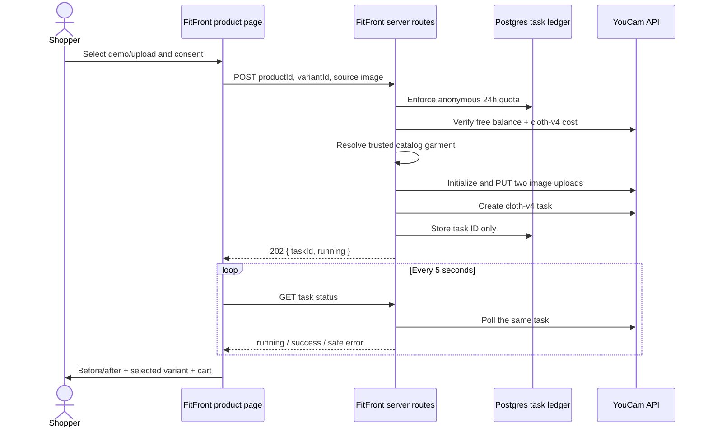

# FitFront

**Live demo:** [fitfront-youcam.vercel.app](https://fitfront-youcam.vercel.app/us)  
**Source:** [github.com/shobhit1kapoor/fitfront-youcam](https://github.com/shobhit1kapoor/fitfront-youcam)

**See the look before you cart it.** FitFront is a YouCam-powered virtual
fitting room embedded in a complete e-commerce journey. A shopper can open a
supported product, use a rights-safe demo model or upload a photo, review the
privacy disclosure, generate an Apparel VTO result, compare before and after,
select a real catalog variant, and add it to the existing cart.

FitFront is an entry for the
[YouCam API Skin AI & Apparel VTO Hackathon](https://youcam-api.devpost.com/).
It is a significant update to the MIT-licensed
[Openfront](https://github.com/openshiporg/openfront) platform—not a rewrite and
not a single API-call wrapper.

## The retail problem

Product photos answer “what does this garment look like?” but not “can I
picture it on me?” That uncertainty causes abandoned carts and avoidable
returns. FitFront moves Apparel VTO to the exact decision point: the product
page, immediately before variant selection and cart creation.

## Significant hackathon updates

The following work was added for the hackathon after July 6, 2026:

- FitFront storefront identity, positioning, homepage, navigation, and
  YouCam-powered product-page call to action.
- A responsive, accessible photo → privacy → result fitting-room experience.
- YouCam Clothes Virtual Try-On v4 integration using server-side file upload,
  asynchronous task creation, five-second polling, and safe error mapping.
- Trusted catalog resolution: the browser sends product/variant IDs, while the
  server chooses the garment image. Arbitrary reference URLs are never accepted.
- Free-unit protection: live balance and feature-cost checks, a 100-unit
  reserve, no paid fallback, and three new tasks per anonymous session per day.
- Privacy-by-design: explicit consent, no photo/result persistence in FitFront,
  an opaque task ledger, and a visible 30-day YouCam retention disclosure.
- An original trademark-free demo-model asset, automated validation/budget
  tests, deployment instructions, licensing, and submission materials.

Openfront's existing catalog, variants, pricing, cart, checkout, account,
dashboard, GraphQL API, and commerce data model remain in place.

## Architecture



The YouCam key, credit responses, presigned upload URLs, and raw provider
payloads never reach the browser. Uploaded photos and generated results are not
written to FitFront's database or logs.

## Supported catalog

The hackathon v1 intentionally supports the five seeded upper-body products:

- Penrose Triangle T-Shirt
- Escher's Staircase Hoodie
- Fibonacci Spiral Crop Top
- Schrödinger's Cat Tank Top
- Paradox Puzzle Sweater

Lower-body and accessory items are hidden from this feature because the Clothes
VTO input rules differ; FitFront avoids pretending that one endpoint fits every
catalog category. Results visualize appearance and are not a sizing guarantee.

## Local setup

Prerequisites: Node.js 20+, PostgreSQL, and a YouCam API key with hackathon units.

```bash
npm install
copy .env.example .env.local
npm run dev
```

Set these values in `.env.local`:

```env
DATABASE_URL="postgresql://..."
SESSION_SECRET="at-least-32-random-characters"
YOUCAM_API_KEY="your-server-only-key"
YOUCAM_API_BASE_URL="https://yce-api-01.makeupar.com"
YOUCAM_UNIT_RESERVE="100"
```

Never prefix the YouCam key with `NEXT_PUBLIC_`. On the first dashboard visit,
create the admin user and run the bundled onboarding flow to seed FitFront's
catalog and local product images.

Useful commands:

```bash
npm run test
npm run seed:fitfront
npm run typecheck
npm run lint
npm run build
```

## Verification and known limitations

The FitFront test suite, focused lint, Keystone schema generation, Prisma schema
validation, and the optimized Next.js production build pass locally. A real
YouCam generation still requires the entrant's server-side hackathon key, and
database migration/seeding requires a PostgreSQL connection.

V1 deliberately handles upper-body apparel only, results are visualizations
rather than sizing predictions, and YouCam result links expire. The extracted
Openfront baseline also contains broad pre-existing type/lint failures and npm
dependency advisories outside the FitFront change set; these should be handled
as a separate upstream-hardening pass before treating the platform as a
production commerce deployment.

## $0 deployment

1. Create a Neon Free Postgres database with no paid upgrade or card.
2. Push this repository to a public Git host.
3. Import it into a personal Vercel Hobby project—do not start a Pro trial.
4. Add the five server-side environment variables listed above.
5. Run `npx prisma migrate deploy` once against the target database, then deploy. Keeping migrations outside the Vercel build prevents parallel builds from competing for Prisma's database advisory lock.
6. Initialize and seed the store, then verify a supported product end-to-end.
7. Keep the deployment available through the hackathon judging period.

The YouCam workflow is split into short create and poll requests, so a serverless
function never waits for the full generation job. No payment provider is needed
for the fitting-room/cart demonstration.

## Privacy, retention, and limits

- The shopper must explicitly consent before any personal photo is transmitted.
- YouCam documents that uploaded/generated files are automatically removed
  after 30 days; result download links remain valid for about two hours.
- FitFront stores only task ID, anonymous session hash, product ID, status, and
  timestamps. It stores no source photo, result image, name, email, or IP address.
- The server checks the live unit balance and current `cloth-v4` cost before
  uploading. If cost lookup fails, it fails closed and spends nothing.
- A successful VTO may consume free YouCam units. FitFront has no paid fallback.

## Submission materials

The ready-to-customize Devpost description, screenshot checklist, acceptance
checklist, and two-minute video script are in [`SUBMISSION.md`](SUBMISSION.md).
Asset provenance is in [`ASSET_ATTRIBUTION.md`](ASSET_ATTRIBUTION.md).

## License and attribution

Openfront is used under the MIT License in [`LICENSE`](LICENSE). See
[`THIRD_PARTY_NOTICES.md`](THIRD_PARTY_NOTICES.md) for attribution and the exact
boundary between the upstream platform and the FitFront hackathon contribution.
